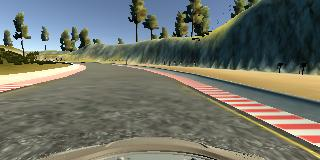
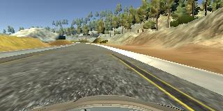
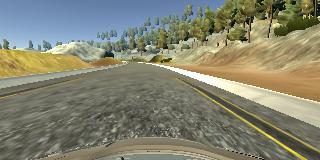
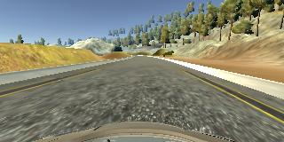

# Behavioral Cloning Project

The goals / steps of this project are the following:
* Use the simulator to collect data of good driving behavior
* Build, a convolution neural network in Keras that predicts steering angles from images
* Train and validate the model with a training and validation set
* Test that the model successfully drives around track one without leaving the road
* Summarize the results with a written report

## Rubric Points

Here I will consider the [rubric points](https://review.udacity.com/#!/rubrics/432/view) individually and describe how I addressed each point in my implementation.  

---
### Files Submitted & Code Quality

#### 1. Submission includes all required files and can be used to run the simulator in autonomous mode

My project includes the following files:
* model.py containing the script to create and train the model
* drive.py for driving the car in autonomous mode
* model.h5 containing a trained convolution neural network 
* writeup_report.md summarizing the results (this file)
* video of autonomous driving around track 1 at https://youtu.be/vdmylbJaUyY

#### 2. Submssion includes functional code
Using the Udacity provided simulator and my drive.py file, the car can be driven autonomously around the track by executing 
```sh
python drive.py model.h5
```

#### 3. Submssion code is usable and readable

The model.py file contains the code for training and saving the convolution neural network. The file shows the pipeline I used for training and validating the model, and it contains comments to explain how the code works.

### Model Architecture and Training Strategy

#### 1. An appropriate model arcthiecture has been employed

My final model is defined in **model.py** and is based on the model architecture described in _Bojarski, et. al. 2016_ paper from Nvidia.  It consists of the following layers:

1. A Keras lambda normalizing layer to center the pixel data at zero
2. Three convolutional layers with 5x5 kernels and 2x2 strides with RELU activation for nonlinearity and l2 regularizers to limit overfitting.  The **add_conv_type1** method (model.py, lines 25-34) defines this type of layers.  The filter depths of these three layers are 12, 18, and 24.  Note that these are substantially less filter depth than the Nvidia architecture.
3. Two convolutional layers with 3x3 kernels and 1x1 strides, both with filter depth of 30.  These are defined in the **add_conv_type2** method (model.py, lines 36-40)
4. A flatten layer to convert convolutional output to densely connected layers.
5. Four densely connected layers with RELU activation for nonlinearity support and dropout with keep probability of 0.5 for overfitting prevention.  These layers have sizes of 2000, 500, 100, and 1, the last being the single floating point steering angle output.

#### 2. Attempts to reduce overfitting in the model

The model contains l2 regularization and dropout layers in order to reduce overfitting (model.py odd lines 57-61). Overfitting has an interesting effect on driving behavior. The bulk of autonomous driving training involves turning the car away from the side of the road.  It's very hard and time consuming to perform these turns in a way that produces smooth driving. Without regularization and drop out, the car would weave sharply like it was trained and result in driving off the road at many points along the track.  This was happening even with the dropout layers.  However, l2 regularization dampens sharpness of turns from the manual training, leading to much less steering and keeping the car in the middle of the road for most of the track.  This was key to allowing the car to drive autonomously all the way around.

The behavior training data was split 80/20 between training and validation to ensure that the model was not overfitting (model.py line 86). The model was tested by running it through the simulator and ensuring that the vehicle could stay on the track.

#### 3. Model parameter tuning

The model used an adam optimizer, so the learning rate was not tuned manually (model.py line 81).  Also I found that a low number of epochs, typically 5 or 6, works sufficiently well.

#### 4. Appropriate training data

Preparing the training data took the most time but was also the most education part of the whole exercise.  With advice to focus "turning data" from both the _Bojarski, et. al. 2016_ paper and the project hints, I did the stop-start turn training of when the car needs to be turned back from the left and right sides of the road. 

I was able to train myself to do this while driving continuously by tapping on the record button at the appropriate time.  There were still a lot driving straight (i.e. 0.0 steering angle) data, and following the note in _Bojarski, et. al. 2016_ that they used more turning data than straight driving data, I added a data processing step where only 1 out of every N driving straight data point was kept (bcdata.py, lines 64-69), and settled on N = 5.  I used only center driving images as data for training purposes.  For details about how I created the training data, see the next section. 

I converted all images to grayscale before feeding them to the model or to the simulator. I did consider reducing the size of the image to 80x160 from 160x320, but the original size worked in this case, though I understand that decreasing the image size is a good optimization to make in a lot of cases. As mentioned above, I also normalized all images using a Keras lambda layer before feeding them to the convolutional layers.

### Model Architecture and Training Strategy

#### 1. Solution Design Approach

The overall strategy for deriving a model architecture was to try something that is known to work and iterate from there.

My first step was to use a convolution neural network model similar to the model described in _Bojarski, et. al. 2016_ that described an Nvidia's success in cloning real-world driving behavior. Aside from its success for Nvidia, I thought this model might be appropriate because we are dealing with 2-D raster images as data, which convolutional neural networks have had a lot of success in classifying.

I chose to use the original image size produced from the simulator of 320x160, which is much bigger than the 200x66 input images that the Nvidia team used.  I experimented with reducing the filter  depth of the convolutional layers that resulted in larger layers with more parameters but roughly the same number of overall layers in the network.  My final network has convolutional layers about half as deep as the original Nvidia model.

In order to gauge how well the model was working, I split my image and steering angle data into an  80% training and a 20% validation set. I found that my first model had a low mean squared error on the training set but a high mean squared error on the validation set. Not only that, but I saw in the autonomous driving behavior that the car steered more sharply where my training was also more sharp and fell off the track in multiple places. Both of these behaviors implied that the model was overfitting. 

To combat the overfitting, I first added dropout with 0.5 keep probability to the dense layers, but this did not make much difference.  I also tried to add more training data around the problematic parts of the track where the car was veering off course, but this was both time consuming and not very helpful.

The overfitting behavior remained, so I added l2 regularization to the first three convolutional layers.  This resulted in a marked dampening of weaving in the autonomous driving behavior that kept the car near the center of the road for the most part and dampened the sharpness of all turns in general, which kept the car on the track all the way around.

At the end of the process, the vehicle is able to drive autonomously around the track without leaving the road.

### 2. Final Model Architecture

The final model architecture (model.py, lines 48-64) consisted of a convolution neural network as described in the Model Architecture and Training Strategy above.  I tried to use keras's model visualization but pydot2 is broken on my machine, and I couldn't find anything on the web that could help.

#### 3. Creation of the Training Set & Training Process

To capture good driving behavior, I recorded numerous data over many trials.  My final data set had 6312 data points over 6 laps of training.  Note that this is after I discarded 1 out of every 5 straight (0.0 steering angle images) to increase representation of the data points with non-zero driving angles.



I then recorded the vehicle recovering from the left side and right sides of the road back to center so that the vehicle would learn to stay on the road.  These images show what a recovery looks like starting from the right side of the road:





Then I repeated this process on track two in order to get more data points, recording only when I am recovering toward the center of the track from the left or right sides.  I did this numerous times when I was still figuring out how to effectively train for autonomous driving.  In the end I used 6312 data points from around six laps around track 1.

I just read about flipping the images here, and that seems clever, but I didn't do that as part of my solution for this project.

The training images were converted to grayscale and normalized around 0 using a Keras lambda layer.

The data is shuffled by the **model.fit** method by default (the **shuffle** parameter defaults to True). I specified 20% of the data for validation by specifying 0.2 as the value of the **validation_split** parameter.

I used this training data for training the model. The validation set helped determine if the model was over or under fitting. The ideal number of epochs was 6 and was determined empirically by generating models with different epochs and see how well they worked. I used an adam optimizer so that manually training the learning rate wasn't necessary.

I found that it was most time efficient to pickle the training data once processed and then load it up to used with the **model.fit** method, particularly when trying out different training parameters.  I did tried to use the **model.fit_generator** method by feeding it one or more image/label pairs.  The **image_generator** method (bctrain.py, lines 46-70) was used to feed data to **model.fit_generator**. However, this massively slowed down training operation, and I had enough memory to use the pickle approach with sufficient training data to keep the car on the track.

### Deliverables

The track 1 video is here: https://youtu.be/vdmylbJaUyY

The model.h5 file is over 320 MB.